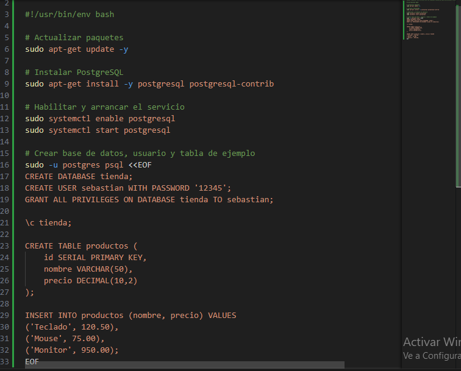
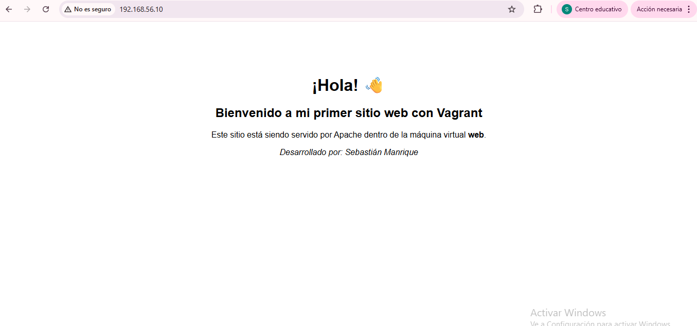
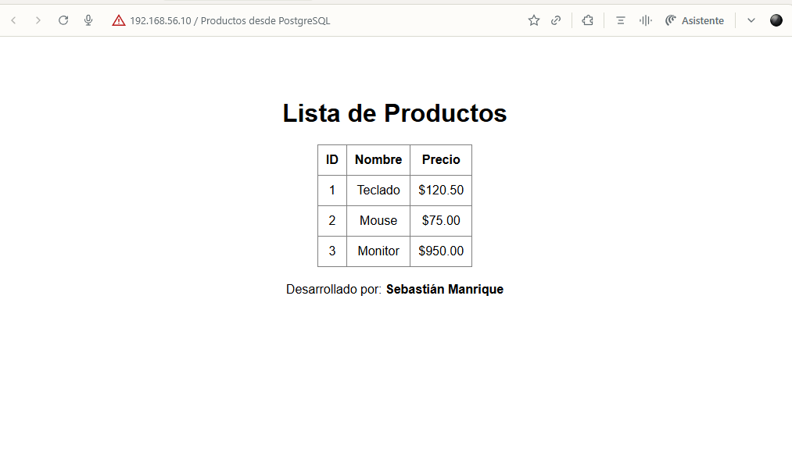

#Proyecto: Vagrant con Provisionamiento mediante Shell

Autor: Sebastián Manrique
Fecha: 27/10/2025

🧩Descripción

Este proyecto crea un entorno de desarrollo con dos máquinas virtuales usando Vagrant:

web: Servidor Apache + PHP.
db: Servidor PostgreSQL con base de datos de ejemplo.

🚀Pasos de instalación

Clonar el repositorio:
git clone https://github.com/sebastianmanrique-0731/vagrant-web-provisioning.git

-Inciar con vagrant up, para ejecutar la maquina

Ingresar a la carpeta:
cd vagrant-web-provisioning

Levantar las máquinas:

1. Levantar solo la máquina web
vagrant up web 

2. Levantar solo la máquina de base de datos
vagrant up db

🧩 Scripts utilizados

-provision-web.sh: Instala Apache y PHP en la máquina web.

-provision-db.sh: Instala PostgreSQL, crea la base de datos y carga datos de ejemplo.

🖥️ Aplicación funcionando

Página principal: http://192.168.56.10

Script PHP con datos desde PostgreSQL: http://192.168.56.10/info.php

